## Баги на странице со скриншота

**1. [Поиск]** Битое изображение у иконки крестика.  
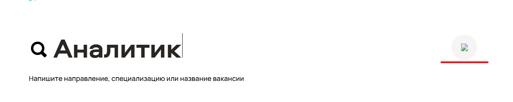
Приоритет: low - UI-баг. Не ассоциируется с действием для удаления текста. 
Ожидаемый результат - отображается правильно иконка для удаления текста у поиска, есть иконка крестика.

**2. [Фильтр]** Кнопки фильтров (Направление, Город, Команда, Формат работы) выровнены по разной вертикали.
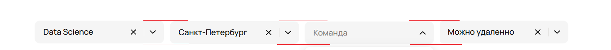
Приоритет: low - UI-баг. Нарушение визуала. 
Ожидаемый результат - фильтра находятся на одной линии, выравнены по вертикали.

**3. [Фильтр_Город]** Фильтр некоректно работает. Присутствуют вакансии, которые не удовлетворяют заданному фильтру (при выбранном фильтре  со значением “Санкт-Петербург” есть вакансии с другими городами Москва(BF10, BF27), Самара(BF18) и без указания города(BF22))
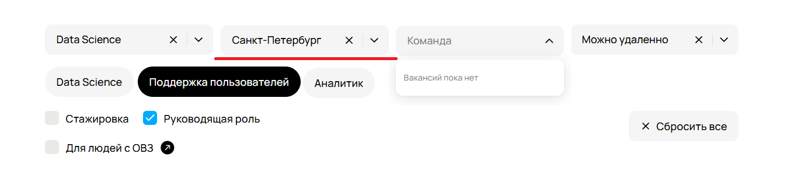
Приоритет: high - UX-баг. Нарушена бизнес-логика.
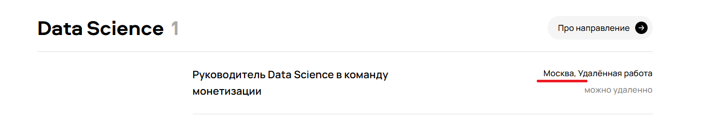
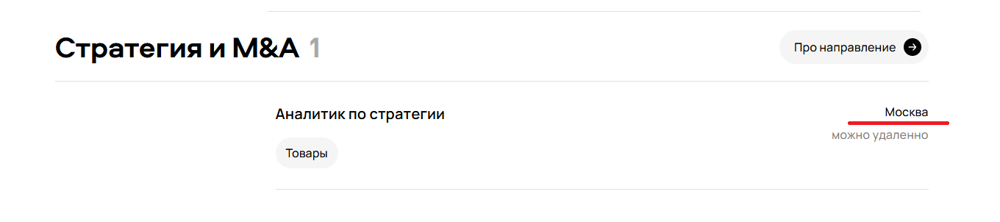
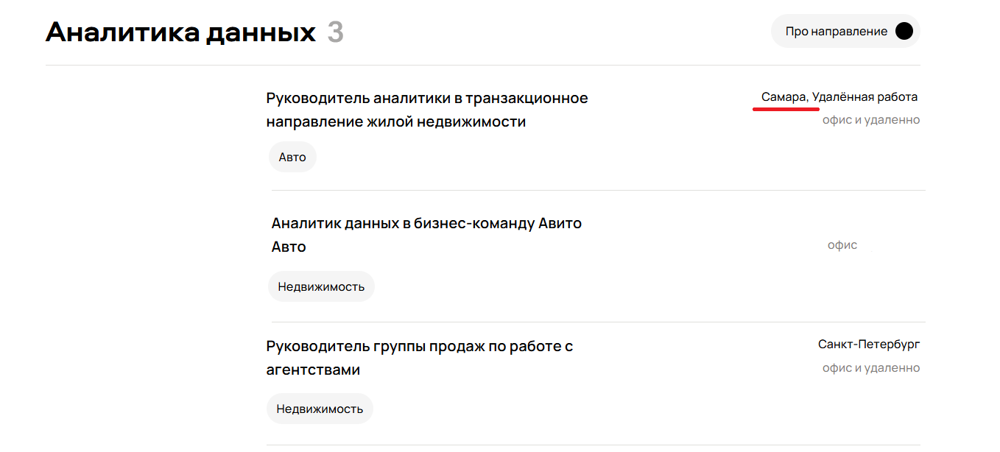
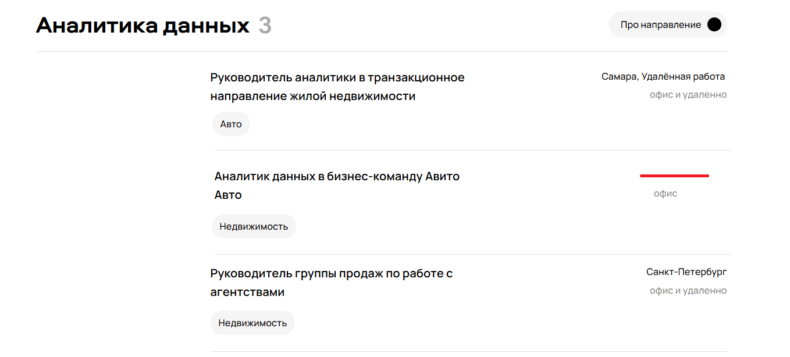
Ожидаемый результат - при выборе фильтра город, отображаются вакансии, только с определенного города.

**4. [Фильтр_Команда]** Фильтр некоректно работает. Присутствуют вакансии, у которых есть фильтр команды: Услуги(BF32), Авто(BF33), Недвижимость(BF33), Товары(BF34).
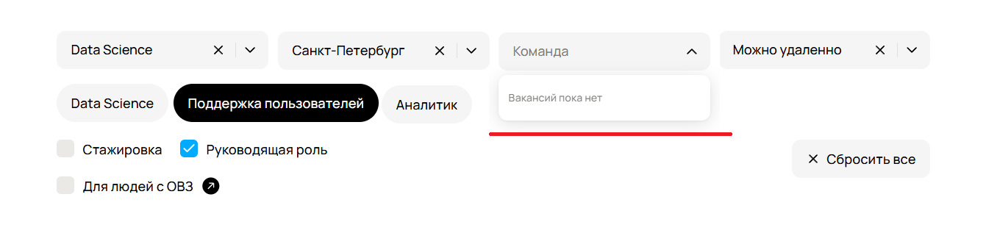
Приоритет: high - UX-баг. Нарушена бизнес-логика.
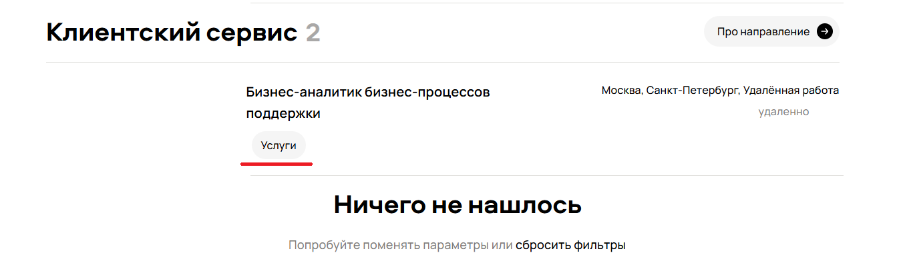
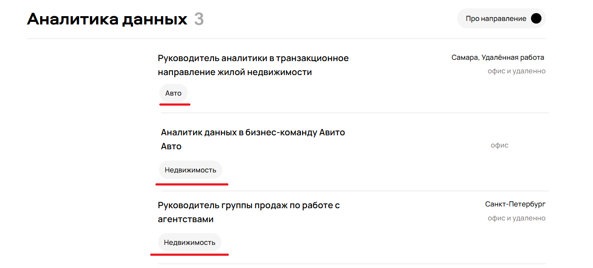
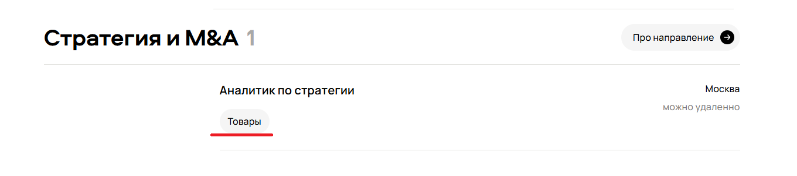
Ожидаемый результат - значения тегов вакансий согласованы с доступными значениями фильтра «Команда», или фильтр их не отображает при их отсутствии.

**5. [Фильтр_Формат_работы]** Фильтр некоректно работает. Присутствуют вакансии с фильтром: удаленно(BF13), офис и удалено(BF19, BF25), офис(BF23).  
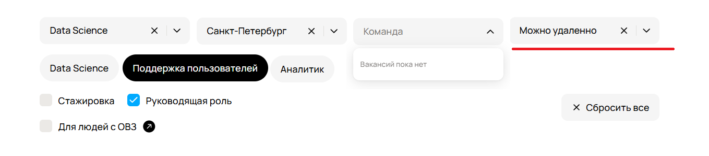
Приоритет: high - UX-баг. Нарушена бизнес-логика.
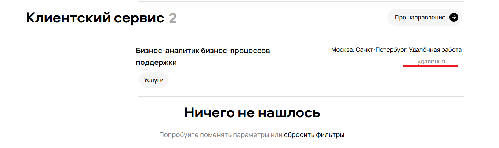
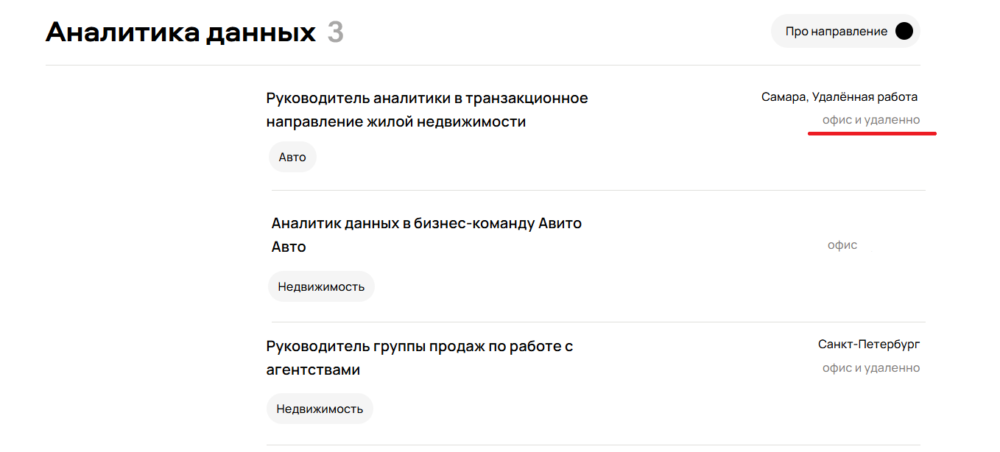
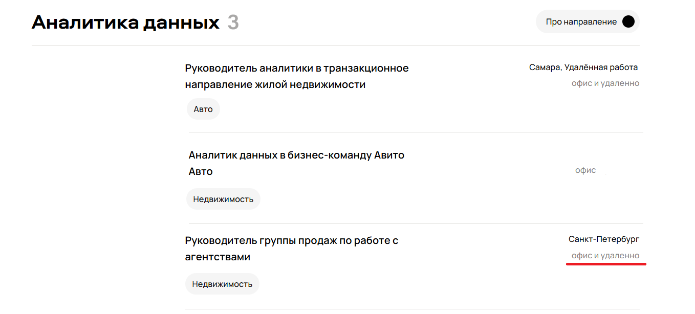
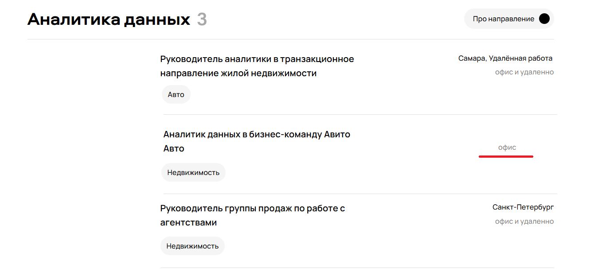
Ожидаемый результат - при выборе фильтра формата работы должны отображаться вакансии только с заданным фильтром, или все если фильтр не выбран.

**6. [Фильтр_Поддержка_пользователей]** Фильтр некоректно работает показаны не только должности поддержки пользователей. Присутствуют другие специализации.
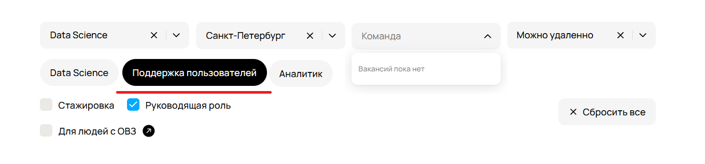
Приоритет: medium - UX-баг. Нарушена бизнес-логика.
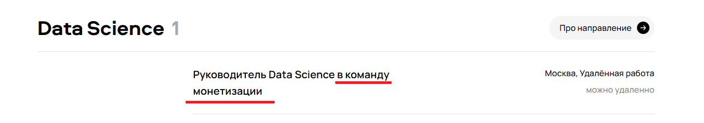
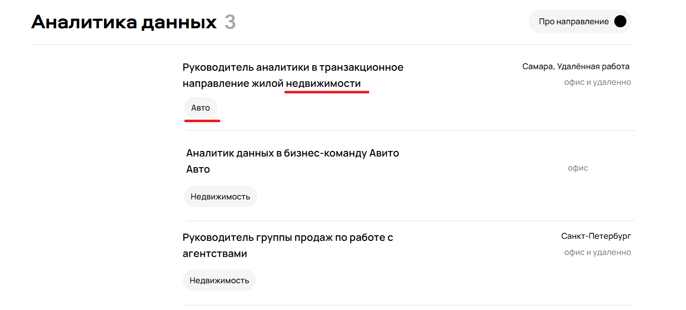
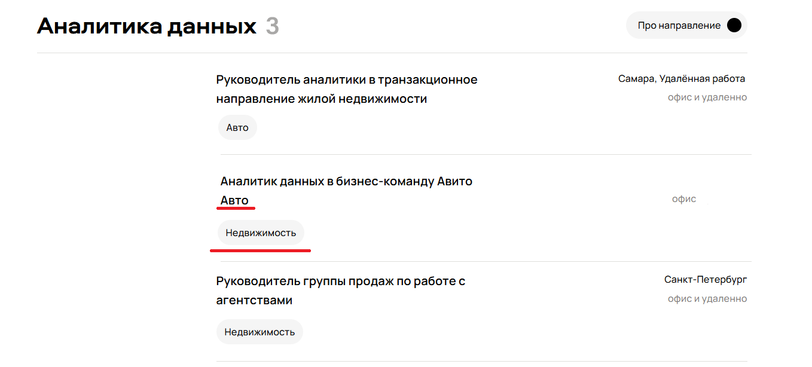
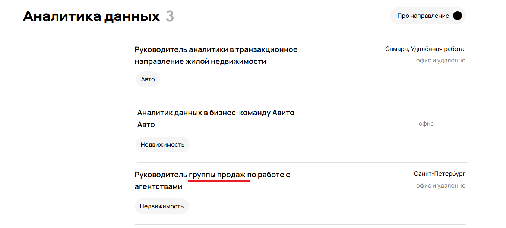
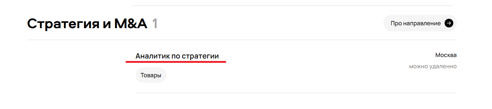
Ожидаемый результат - показываются, только вакансии с тегом поддержка пользователей. По ключевым словам без описания вакансии непонятна должность.

**7. [Фильтр_Руководящая_роль]** Фильтр некоректно работает показаны не только руководящие роли. Присутствуют другие роли, помимо руководящей.
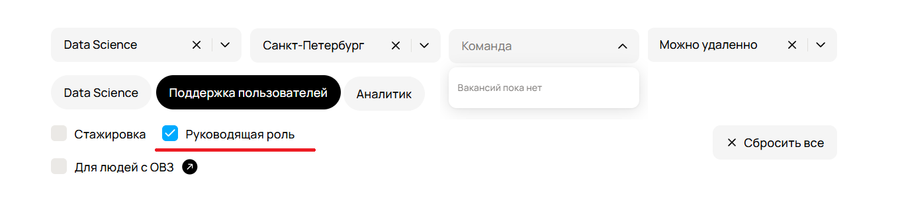
Приоритет: high - UX-баг. Нарушена бизнес-логика.
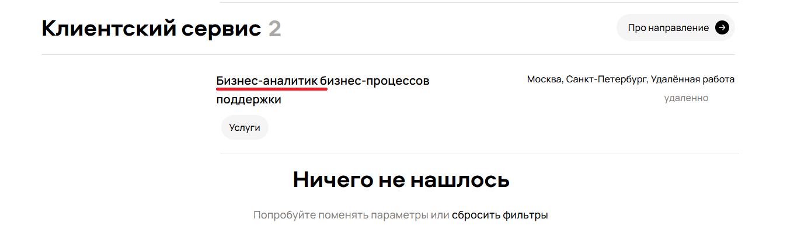
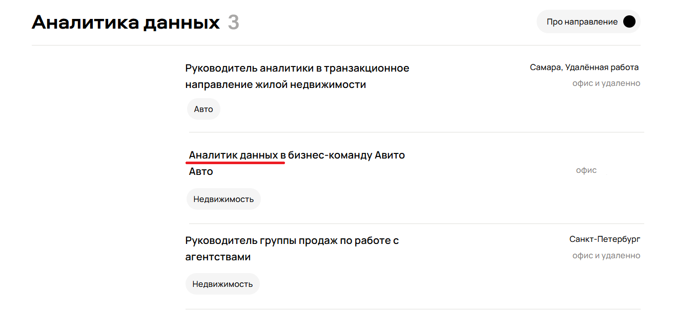

Ожидаемый результат - показываются, только вакансии удовлетворяющие фильтр руководящая роль при его выборе.

**8. [Счётчик_вакансий]** Счётчик количества неправильно показывает фактическое количество вакансий.
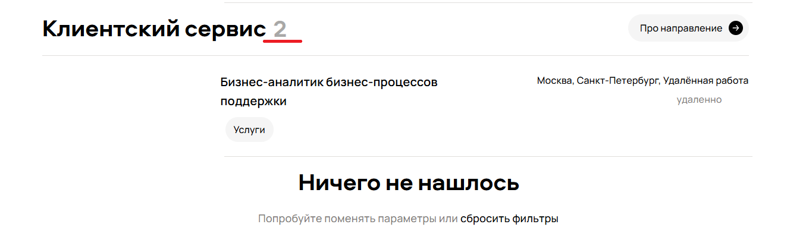
Приоритет: medium.
Ожидаемый результат - в пункте Клиентский сервис счётчик отображает фактическое количество вакансий, соответствующих фильтру.

**9. [Сообщение]** Противоречие между "Ничего, не нашлось" и тем, что отображается вакансия.
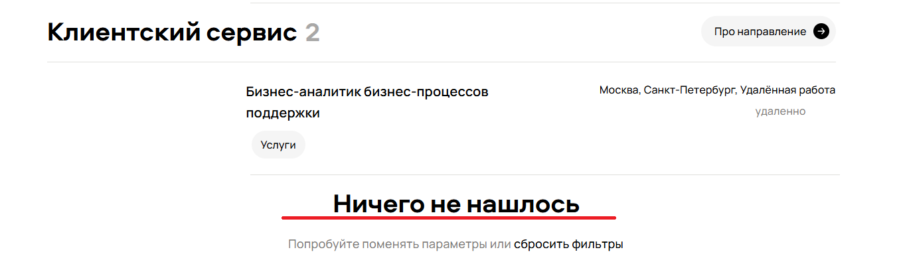
Приоритет: high - UX-баг. Нарушена бизнес-логика.
Ожидаемый результат - по данным фильтрам и тегам есть вакансии, поэтому не должно выходить такое сообщение.

**10. [Ошибка_дизайна]** Разные элементы у кнопок перехода"Про направление", нет стрелочки . 
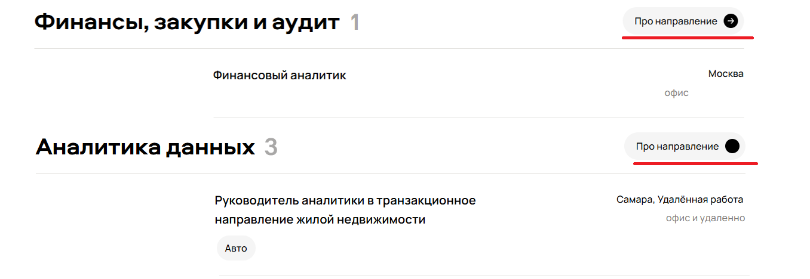
Приоритет: low.
Ожидаемый результат - дизайн должен быть единным у одиннаковых элементов.

**11. [Несоответствие_тегов]** Данные перепутаны местами тег Авто и Недвижимость.

Приоритет: medium. 
Ожидаемый результат - машина является движемым имуществом, поэтому тег должен быть Авто, вместо Недвижимость.  

**12. [Орфографическая_ошибка]** В тексте опечатка в теле футера. 
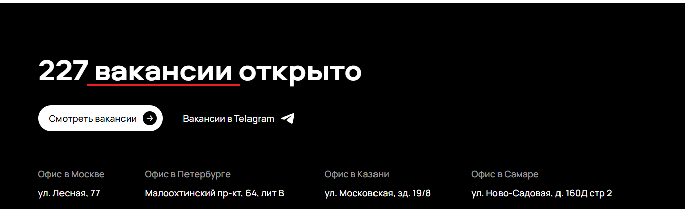
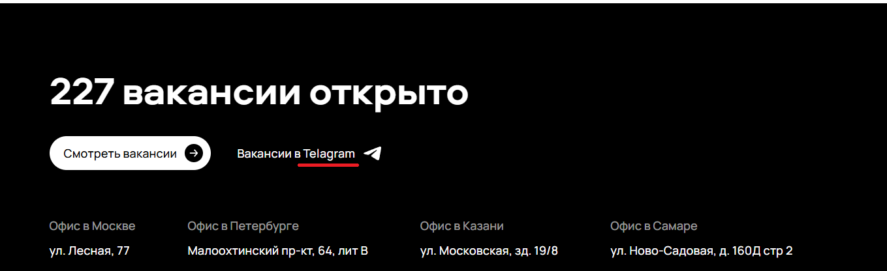
Приоритет: low.
Ожидаемый результат - текст должен содержать вакансий и telegram.

**13. [Неправильный_адрес]** В футере опечатка, неправильно указан адрес офиса.
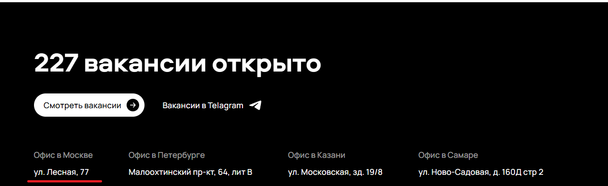
Приоритет: medium.
Ожидаемый результат - ул. Лесная, 7.

**14. [Контентная_ошибка]** Футер не отображается до конца страницы. Не хватает дополнительной информации.
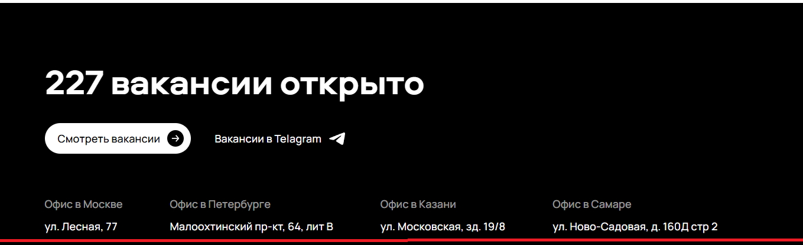
Приоритет: low.
Ожидаемый результат - в футере отсутствует дополнительная информация о компании.